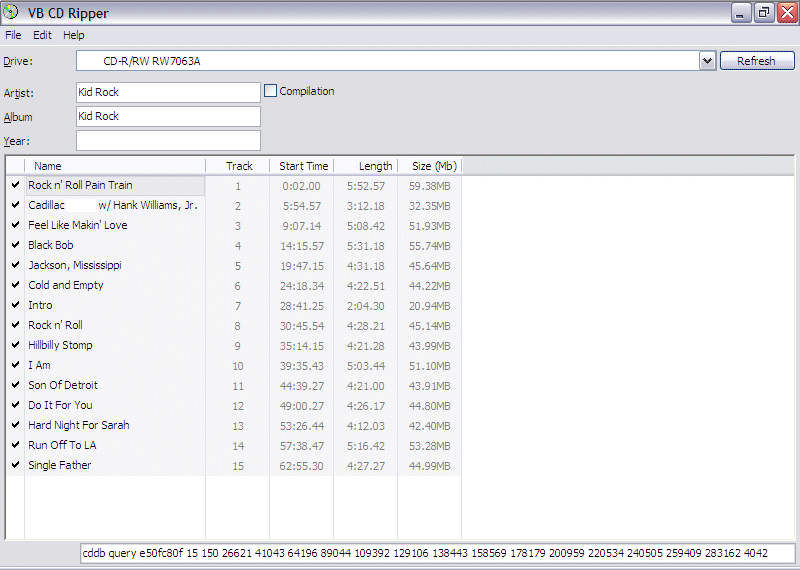



## VBAL\- Plugable VB CD Ripper \- With CDDB Lookup

### Description

While getting accustomed to working with the VB Accelerator CD ripping project files I was able to put two of them together to build a Plugable CD Ripper with CDDB lookup. Eventually all this has got to go into Almost Real Jukebox. However I figured a few might like to use the CD Ripper by its self for now so here it is. Please be sure to read the Requirements.txt text file. All the support files, DLL & OCX's are listed & VB Accelerators website link, to make this horse work. All the support files are available from VB Accelerator. It took a lot of work to combine the two project programs so I hope you enjoy it !! If you find it useful please vote !
 
### More Info
 

             |
---                |---
**Submitted On**   |2004-10-24 17:17:48
**By**             |[Thomas Swift](https://github.com/Planet-Source-Code/PSCIndex/blob/master/ByAuthor/thomas-swift.md)
**Level**          |Advanced
**User Rating**    |5.0 (10 globes from 2 users)
**Compatibility**  |VB 6\.0
**Category**       |[Sound/MP3](https://github.com/Planet-Source-Code/PSCIndex/blob/master/ByCategory/sound-mp3__1-45.md)
**World**          |[Visual Basic](https://github.com/Planet-Source-Code/PSCIndex/blob/master/ByWorld/visual-basic.md)
**Archive File**   |[VBAL\-\_Plug18097210242004\.zip](https://github.com/Planet-Source-Code/thomas-swift-vbal-plugable-vb-cd-ripper-with-cddb-lookup__1-56896/archive/master.zip)

